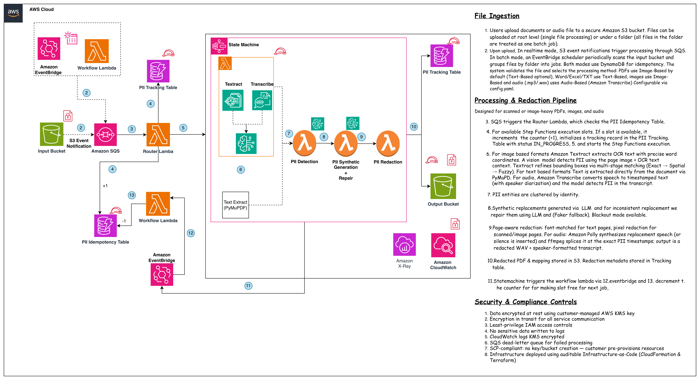

# PII Anonymization & Redaction System

---

## DISCLAIMER

**This tool is provided as a sample/reference implementation. It is ultimately the user's responsibility to validate proper PII data anonymization. The PII anonymizer is an AI tool to automate and accelerate the data preparation process — it is not infallible and should not be used as the sole mechanism for PII protection without human verification.**

---

## Overview

An automated pipeline that detects and redacts PII from documents and audio files uploaded to Amazon S3. The system uses AWS Step Functions to orchestrate 6 Lambda functions (routing, detection, synthetic generation, and redaction) with SQS for backpressure control and DynamoDB for concurrency management and audit trails. Amazon Bedrock provides AI-powered PII detection, Amazon Textract handles OCR and bounding box refinement, Amazon Transcribe provides audio transcription with speaker diarization, Amazon Polly synthesizes replacement speech, and all data is encrypted with customer-managed KMS keys.



### Architecture

The pipeline consists of these AWS services:

| Component     | Service                                        | Purpose                                                               |
| ------------- | ---------------------------------------------- | --------------------------------------------------------------------- |
| Ingestion     | S3 + SQS                                       | Document upload and message queuing                                   |
| Orchestration | Step Functions                                 | 3-step pipeline: Detect → Synthetic → Redact                          |
| Processing    | 6 Lambda Functions                             | Router, Detection, Synthetic, Redact, Batch Trigger, Workflow Tracker |
| AI/ML         | Amazon Bedrock + Textract + Transcribe + Polly | PII detection (text + vision + audio), OCR, speech synthesis          |
| Storage       | S3 (output) + DynamoDB                         | Redacted files, tracking metadata, concurrency control                |
| Scheduling    | EventBridge                                    | Batch trigger schedule + Step Functions completion events             |
| Monitoring    | CloudWatch                                     | Logs with configurable retention and KMS encryption                   |
| Security      | KMS + IAM                                      | Customer-managed encryption, least-privilege roles                    |

### How It Works

**Document Ingestion**

1. Users upload documents to a secure Amazon S3 bucket. Files can be uploaded at root level (single file processing) or under a folder (all files in the folder are treated as one batch job).
2. In realtime mode, S3 event notifications trigger processing through SQS. In batch mode, an EventBridge scheduler periodically scans the input bucket and groups files by folder into jobs. Both modes use DynamoDB for idempotency.
3. SQS triggers the Router Lambda, which checks the Idempotency Table for available Step Functions execution slots. If a slot is available, it increments the counter (+1), initializes a tracking record in the PII Tracking Table with status `IN_PROGRESS`, and starts the Step Functions execution.

**Image-Based Redaction**: Designed for scanned or image-heavy PDFs and standalone images.

4. Amazon Textract extracts OCR text with precise word coordinates.
5. A vision model detects PII using the page image + OCR text context. Textract refines bounding boxes via multi-stage matching (Exact → Spatial → Fuzzy).
6. PII entities are clustered by identity. Synthetic replacements generated via LLM (Faker fallback). Blackout mode available.
7. Pixel redaction: every page is rendered and flattened to a redacted image, so the output PDF has no text layer (PII cannot leak through a hidden/searchable text layer).
8. Redacted PDF stored in S3. Redaction mappings stored in Tracking table.

**Text-Based Redaction**: Designed for digitally generated PDFs, Word, Excel, and text files.

4. Text is extracted directly from the document via pypdf.
5. A language model detects PII using threaded parallel processing.
6. PII entities are clustered by identity. Synthetic replacements generated via LLM (Faker fallback). Blackout mode available.
7. Redacted document stored in S3 (text for PDFs, original format for Word/Excel).
8. Redaction mappings stored in Tracking table.

**Audio-Based Redaction**: Designed for audio recordings (.mp3, .wav).

4. Amazon Transcribe transcribes audio with word-level timestamps and speaker diarization.
5. A language model detects PII in the transcript text.
6. PII entities are clustered by identity. Synthetic replacements generated via LLM (Faker fallback).
7. Amazon Polly synthesizes replacement speech (or silence is inserted). ffmpeg splices replacements at exact PII timestamps.
8. Redacted audio (WAV) + speaker-formatted transcript stored in S3.

**Completion**

9. After the Step Functions pipeline completes, EventBridge captures the completion event and triggers the Workflow Lambda, which decrements the concurrency counter (-1) in the Idempotency Table and updates the job status in the Tracking Table.

### Processing Modes

The pipeline supports two modes, set via `ProcessingMode` (CFN) or `processing_mode` (Terraform):

| Mode         | Trigger                                                          | Best For                                                                     |
| ------------ | ---------------------------------------------------------------- | ---------------------------------------------------------------------------- |
| **Realtime** | S3 event notification → SQS → Router                             | Interactive uploads, low-to-medium volume                                    |
| **Batch**    | EventBridge schedule → Batch Trigger scans bucket → SQS → Router | Bulk processing, SCP-restricted environments, automatic retry of failed jobs |

Files uploaded to the root of the input bucket are processed individually. Files uploaded under a folder are grouped into one job: the folder name becomes the job ID. In batch mode, `JobFolderDepth` controls how deep the grouping goes (1 = top-level folder, 2 = subfolder, etc.).

See [Processing Modes](docs/processing-modes.md) for the full comparison, folder depth examples, skip logic, and how to switch.

### Supported File Formats

| Format     | Extensions                                                | Processing Approach                 | Output Format             | Options                                                     |
| ---------- | --------------------------------------------------------- | ----------------------------------- | ------------------------- | ----------------------------------------------------------- |
| **PDF**    | `.pdf`                                                    | Image-Based (default) or Text-Based | PDF (image) or TXT (text) | Bounding box overlay, blackout mode, synthetic replacement  |
| **Word**   | `.docx`                                                   | Text-Based                          | DOCX (original format)    | Yellow highlight on replaced text, blackout mode            |
| **Excel**  | `.xlsx`, `.csv`                                           | Text-Based                          | XLSX (original format)    | Yellow cell background highlight, blackout mode             |
| **Images** | `.jpg`, `.jpeg`, `.png`, `.tiff`, `.tif`, `.bmp`, `.webp` | Image-Based                         | Same image format         | Bounding box overlay, blackout mode, synthetic text overlay |
| **Text**   | `.txt`                                                    | Text-Based                          | TXT                       | Synthetic replacement, blackout mode                        |
| **Audio**  | `.mp3`, `.wav`                                            | Audio-Based (Transcribe + Polly)    | WAV + transcript          | Synthetic speech replacement or silence mode                |

### Redaction Modes

| Mode                    | What it does                                                                  | When to use                                                          |
| ----------------------- | ----------------------------------------------------------------------------- | -------------------------------------------------------------------- |
| **Synthetic** (default) | Replaces PII with realistic fake data (e.g. "John Smith" → "Robert Chen")     | When you need the document to remain readable and contextually valid |
| **Blackout**            | Replaces PII with solid black rectangles (images/PDFs) or `[REDACTED]` (text) | When you need maximum certainty that PII is removed                  |

### Where Results Are Stored

**S3 Output Bucket:**

- Redacted files: `{job_id}/{original_folder_structure}/{filename}` (batch) or `{filename}` (single)
- Redaction reports: `{job_id}/intermediate/redactions/{safe_name}/redactions.json`
- Synthetic mappings: `{job_id}/intermediate/synthetic/synthetic_mapping.json`

**DynamoDB Tracking Table** (metadata only, no PII stored):

- `filename` (PK): job ID or folder name
- `timestamp` (SK): ISO timestamp
- `status`: `IN_PROGRESS` → `DETECTING` → `DETECT_COMPLETE` → `GENERATING_SYNTHETIC` → `SYNTHETIC_COMPLETE` → `REDACTING` → `COMPLETE` or `FAILED`
- `files`: list of file names in the job
- `failed_files`: map of files that failed at each stage
- `mapping_s3_key`: S3 path to synthetic_mapping.json
- `redaction_results`: JSON summary of per-file redaction results
- `expiration_time`: TTL for automatic cleanup

### Key Features

- Multi-format support: PDF, DOCX, XLSX, CSV, TXT, TIFF, PNG, JPEG, BMP, WebP, MP3, WAV
- Step Functions pipeline with 6 Lambda handlers and SQS backpressure control
- Two PDF modes: text-based (fast, text output) and image-based (preserves layout, PDF output)
- Bounding box pipeline: normalization, exact match, spatial match (multi-column), fuzzy match (80% threshold for OCR errors)
- Synthetic replacement with LLM-powered repair for cross-entity consistency
- Blackout mode: solid-fill redaction instead of synthetic replacement
- Bounding box overlay: toggle on/off for visual debugging of detected PII regions
- Configurable Bedrock models (Claude, Amazon Nova, OpenAI GPT-5.x) via `src/config.yaml`
- Per-model controls: OpenAI `reasoning_effort` (none…xhigh), Claude extended `thinking`; the UI offers only the options each selected model supports
- Output-limit safety: detection chunks/batches are sized to each model's output limit (Nova caps at 10K), Excel/CSV sheets are sub-split, and a truncated detection fails loudly rather than silently dropping PII
- DynamoDB concurrency control with configurable max concurrent workflows
- Customer-managed KMS encryption for all services (S3, DynamoDB, SQS, CloudWatch)
- CloudWatch log groups with configurable retention (default 365 days)
- SQS dead-letter queue for failed message handling
- Dataclass-based I/O validation to catch malformed AI responses
- Audio PII redaction: Transcribe → Bedrock detection → Polly synthesis or silence → ffmpeg splice
- Speaker diarization in audio transcripts for conversational readability
- Streamlit UI for interactive document/audio upload, batch monitoring, and result review

---

## Project Structure

```
pii-anonymizer/
├── src/                            # Lambda + core processing code
│   ├── config.yaml                 # Model and processing config
│   ├── pricing.yaml                # Bedrock pricing for cost estimation
│   ├── core/                       # Core processing logic
│   │   ├── pii_detector.py         # PII detection (text + vision)
│   │   ├── synthetic_pii_generator.py  # Synthetic data generation + repair
│   │   ├── redactor.py             # Multi-format redaction orchestrator
│   │   ├── prompts.py              # Detection prompts (text + vision)
│   │   ├── value_categorizer.py    # PII clustering and categorization
│   │   └── text_replacer.py        # Text replacement engine
│   ├── handlers/                   # Lambda entry points
│   │   ├── router_handler.py       # SQS → concurrency check → Step Functions
│   │   ├── pii_detection_handler.py    # Step 1: detect PII
│   │   ├── synthetic_handler.py    # Step 2: generate synthetic replacements
│   │   ├── redact_handler.py       # Step 3: apply redaction
│   │   ├── batch_trigger_handler.py    # EventBridge → scan bucket → SQS
│   │   └── workflow_tracker_handler.py # SF completion → decrement counter
│   ├── processors/                 # Format-specific processors
│   │   ├── pdf_image_processor.py  # PDF image-based pipeline
│   │   ├── pdf_text_processor.py   # PDF text-based pipeline
│   │   ├── word_processor.py       # Word (.docx) processing
│   │   ├── tabular_processor.py    # Excel (.xlsx, .csv) processing
│   │   ├── txt_processor.py        # Plain text processing
│   │   ├── image_processor.py      # Standalone image processing
│   │   └── audio_processor.py      # Audio processing (Transcribe + Polly + ffmpeg)
│   ├── helpers/                    # Shared utilities
│   │   ├── config_loader.py        # S3 → local → defaults config loading
│   │   ├── textract_helper.py      # Textract OCR + bbox refinement
│   │   ├── threaded_detector.py    # Concurrent PII detection
│   │   ├── text_chunker.py         # Text chunking for LLM context
│   │   ├── model_config_helper.py  # Bedrock model configuration
│   │   ├── model_router.py         # Per-model inference shaping (sampling, thinking, effort)
│   │   ├── pdf_processor.py        # PDF page extraction
│   │   ├── page_type_checker.py    # Detect text vs scanned pages
│   │   ├── font_config.py          # Font path resolution
│   │   ├── token_tracker.py        # Token usage tracking
│   │   ├── throttle_handler.py     # Bedrock throttle retry logic
│   │   ├── observability.py        # X-Ray tracing init (app-level, safe no-op fallback)
│   │   └── log_scrubber.py         # PII scrubbing from logs
│   ├── redaction/                  # Redaction engines
│   │   └── pdf_redactor.py         # PDF redaction (flatten-to-image)
│   ├── validation/                 # Input/output validation
│   │   ├── model_schemas.py        # Dataclass-based I/O validation
│   │   ├── document_validator.py   # File type validation
│   │   └── pdf_validator.py        # PDF-specific validation
│   ├── infra/                      # AWS service integrations
│   │   ├── dynamodb_manager.py     # DynamoDB operations
│   │   └── sqs_handler.py          # SQS message handling
│   └── fonts/                      # Bundled fonts for PDF redaction
│       └── DejaVuSans.ttf
├── frontend/                       # Streamlit web UI
│   ├── app.py                      # Main app (upload, monitor, review)
│   ├── README.md                   # Frontend setup and features
│   ├── requirements.txt
│   └── .env.example                # Frontend config template
├── docs/                           # Per-topic documentation
│   ├── detection.md                # PII detection pipeline
│   ├── synthetic.md                # Synthetic data generation
│   ├── redaction.md                # Per-format redaction
│   ├── audio.md                    # Audio PII redaction (Transcribe + Polly + ffmpeg)
│   ├── infrastructure.md           # Runtime AWS services
│   ├── config.md                   # config.yaml reference
│   ├── processing-modes.md         # Realtime vs Batch
│   ├── SECURITY.md                 # Security guide
│   └── IAM-Permissions.md          # Per-Lambda IAM roles and permissions
├── infra/
│   ├── cfn/                        # CloudFormation (SAM) deployment
│   │   ├── template.yaml           # SAM template
│   │   ├── deploy.sh               # Build + package + deploy script
│   │   ├── parameters.example.json # Parameter template (copy to parameters.json)
│   │   └── README.md               # Deployment guide
│   ├── terraform/                  # Terraform deployment
│   │   ├── main.tf
│   │   ├── variables.tf
│   │   ├── output.tf
│   │   ├── terraform.tfvars.example  # Variable template (copy to terraform.tfvars)
│   │   ├── README.md               # Deployment guide
│   │   └── modules/                # Lambda, IAM, SQS, EventBridge, Step Functions
│   └── statemachine/
│       └── pii_processing.asl.json # Step Functions definition
├── layers/                         # Lambda layer
│   └── lambda_layer/               # python/ (gitignored, auto-built) + fonts/
├── images/                         # Architecture diagrams
├── sample-data/                    # Test documents (PDF, DOCX, XLSX, TIF, TXT, CSV, MP3)
├── Dockerfile.layer                # Docker build for Lambda layer
├── pii_detection_demo.ipynb        # Jupyter notebook for local testing
├── generate_frontend_env.sh        # Auto-generate frontend .env from stack outputs
├── Makefile                        # Build and deploy shortcuts
├── create_layer.sh                 # Lambda layer builder
├── pyproject.toml                  # Python package config (PEP 621)
├── requirements_lambda.txt         # Lambda layer dependencies
├── uv.lock                         # Dependency lock file
├── VERSION                         # Project version
├── CHANGELOG.md                    # Version history
├── CONTRIBUTING.md                 # Contribution guidelines
├── CODE_OF_CONDUCT.md              # Amazon Open Source Code of Conduct
├── NOTICE                          # Copyright and attribution notice
└── LICENSE                         # Apache-2.0 license
```

---

## Quick Start

### Prerequisites

- [Git](https://git-scm.com/downloads) and `make` (pre-installed on macOS/Linux; on Windows use Git Bash)
- [AWS CLI v2](https://docs.aws.amazon.com/cli/latest/userguide/getting-started-install.html) configured with credentials (`aws configure`)
- [Docker Desktop](https://www.docker.com/products/docker-desktop/): **required on Windows**, recommended on macOS/Linux (used to build the Lambda layer)
- AWS account with access to: Lambda, S3, DynamoDB, Bedrock, Textract, Transcribe, Polly, Step Functions, SQS, EventBridge, CloudWatch, IAM
- **ffmpeg**: required for audio processing. Deployed as a Lambda layer (`ffmpeg-static`); for local testing install via `brew install ffmpeg` (macOS) or your package manager
- Three S3 buckets, which must already exist (the stack does not create them):
  - Input bucket (documents to process)
  - Output bucket (redacted results)
  - Artifact bucket (SAM packaging, CFN only, not needed for Terraform)
- Amazon Bedrock model access enabled in your region (e.g. Nova Pro, Claude)

**Platform support:**

| Platform           | Layer Build      | Deploy | Notes                                                          |
| ------------------ | ---------------- | ------ | -------------------------------------------------------------- |
| macOS              | ✅ Docker or pip | ✅     | Auto-detects Docker, falls back to pip cross-compile           |
| Linux              | ✅ Docker or pip | ✅     | Same as macOS                                                  |
| Windows (Git Bash) | ✅ Docker only   | ✅     | Docker Desktop required; path conversion handled automatically |
| Windows (WSL)      | ✅ Docker or pip | ✅     | Behaves like Linux                                             |

```bash
# Clone the repo (replace the URL with this repository's Git URL)
git clone https://github.com/<your-org>/pii-anonymizer.git
cd pii-anonymizer

# Create your S3 buckets (if they don't exist)
aws s3 mb s3://my-pii-input --region us-east-2
aws s3 mb s3://my-pii-output --region us-east-2
aws s3 mb s3://my-pii-artifacts --region us-east-2   # CFN only
```

### Deploy with CloudFormation

No local Python environment needed. The Lambda layer builds its own dependencies.

1. Install AWS SAM CLI: `brew install aws-sam-cli` (macOS) or see [install guide](https://docs.aws.amazon.com/serverless-application-model/latest/developerguide/install-sam-cli.html)
2. Configure `src/config.yaml` (model, processing approach, redaction mode)
3. Copy and fill in parameters: `cp infra/cfn/parameters.example.json infra/cfn/parameters.json`
4. Run `make cfn-deploy`

The stack name is derived from the `FunctionName` parameter. See [Deployment](#deployment) for full details and all parameters.

### Deploy with Terraform

1. Install Terraform: `brew install terraform` (macOS) or see [install guide](https://developer.hashicorp.com/terraform/install)
2. Configure `src/config.yaml` (model, processing approach, redaction mode)
3. Copy and fill in variables: `cp infra/terraform/terraform.tfvars.example infra/terraform/terraform.tfvars`
4. Run `make tf-init && make tf-deploy`

See [Deployment](#deployment) for full details and all variables.

### Local Development & Testing

The Jupyter notebook (`pii_detection_demo.ipynb`) runs the same detection pipeline as Lambda. Good for testing prompts, checking bounding boxes, and comparing models before you deploy.

Requires Python 3.13 and either [uv](https://docs.astral.sh/uv/) or pip:

```bash
# Option A: uv (recommended, faster, uses lockfile)
curl -LsSf https://astral.sh/uv/install.sh | sh   # install uv
uv sync --all-extras
source .venv/bin/activate

# Option B: pip
python3.13 -m venv .venv
source .venv/bin/activate
pip install -e ".[all]"
```

Then start the notebook:

```bash
jupyter notebook
# Open pii_detection_demo.ipynb
```

The notebook has sections for each format: PDF (text + image approaches), Word, Excel, TXT, and Images. Sample documents are in `sample-data/`.

### Code Quality (Linting & Formatting)

This project uses [Ruff](https://docs.astral.sh/ruff/) for Python linting and formatting. The rules live in `pyproject.toml` (`[tool.ruff]`), so everyone uses the same configuration.

Ruff is installed with the dev/test extras (`uv sync --all-extras` or `pip install -e ".[all]"`). Then:

```bash
ruff check .            # lint (find problems)
ruff check --fix .      # lint and auto-fix what it can
ruff format .           # apply formatting
```

**Run checks automatically on every commit** (recommended) via [pre-commit](https://pre-commit.com/):

```bash
pip install pre-commit      # (included in the dev/test extras)
pre-commit install          # one-time, in your clone
```

After `pre-commit install`, each `git commit` runs ruff and the other hooks in `.pre-commit-config.yaml` (private-key detection, large-file checks, YAML/JSON validation, codespell, etc.) on your staged files and blocks the commit if anything fails.

> Linting is also **enforced in CI**: the `python-lint.yml` workflow runs `ruff check` on changed Python files for every pull request, so checks apply even if you skip the local setup.

### Configure

Edit `src/config.yaml` to set your model and processing approach:

```yaml
processing:
  approach: "image" # text | image (PDF only; Word/Excel/TXT always use text)

model:
  # Claude (anthropic), Nova (amazon), or OpenAI GPT-5.x (openai). See docs/config.md.
  id: "global.anthropic.claude-sonnet-4-6"
  provider: "anthropic" # anthropic | amazon | openai (auto-derived in the UI)
  # Per-model inference capabilities (overrides built-in defaults). Adding a
  # model = one entry. sampling = accepts temperature/top_k; thinking style;
  # max_output_tokens caps maxTokens + chunk size. See docs/config.md.
  capabilities:
    "opus-4-8":
      {
        sampling: false,
        thinking: "adaptive_effort",
        efforts: [low, medium, high, max, xhigh],
        max_output_tokens: 64000,
      }
    "openai.gpt-5":
      {
        sampling: false,
        thinking: "reasoning_effort",
        efforts: [none, low, medium, high, xhigh],
      }
    "nova": { sampling: true, thinking: null, max_output_tokens: 10000 }

detection:
  reasoning_effort: "none" # OpenAI GPT-5.x + new Claude effort (none|low|medium|high|xhigh|max); ignored by Nova/legacy Claude
  enable_thinking: false # Claude only, extended thinking; ignored by Nova/OpenAI

redaction:
  mode: "synthetic" # synthetic | blackout

markers:
  tabular: false # yellow cell highlight for Excel
  word: false # yellow text highlight for Word
```

> **Choosing a model:** Claude or GPT for large/PII-dense documents (high output limits); Nova for normal-sized documents, speed, and cost (10K output cap: a truncated detection fails loudly rather than dropping PII). OpenAI GPT-5.x is US-regions-only. See [docs/config.md](docs/config.md) for per-model details, reasoning effort, and thinking.

Review `src/core/prompts.py` before deploying. The default prompts target financial and healthcare documents. Adjust them for your specific domain. See [docs/config.md](docs/config.md) for the full configuration reference.

---

## Deployment

Two options: CloudFormation (SAM) or Terraform. Both create the same resources.

### Option A: CloudFormation (SAM)

The SAM template deploys the full pipeline: 6 Lambdas, Step Functions, SQS, DynamoDB, EventBridge, CloudWatch log groups, and IAM roles. It handles SCP-restricted environments where buckets and KMS keys are pre-provisioned.

**Step 1: Create your parameters file**

```bash
cp infra/cfn/parameters.example.json infra/cfn/parameters.json
```

Edit `parameters.json` with your values. At minimum you need:

- `Region`: AWS region with Bedrock + Textract access
- `S3InputBucketName`: your existing input bucket
- `S3OutputBucketName`: your existing output bucket
- `ArtifactBucket`: S3 bucket for SAM to upload Lambda code and layer

**Step 2: Deploy**

```bash
make cfn-deploy
```

This runs `deploy.sh` which:

1. Auto-builds the Lambda layer if `layers/lambda_layer/python/` is missing (first deploy after clone)
2. Runs `sam build` to package Lambda code
3. Runs `sam package` to upload artifacts to your S3 bucket
4. Runs `aws cloudformation deploy` to create/update the stack

**Step 3: Verify**

```bash
# Upload a test document
aws s3 cp sample-data/healthcare_records.txt s3://your-input-bucket/test-job/

# Check DynamoDB for job status
aws dynamodb scan --table-name YOUR-TABLE-NAME --region YOUR-REGION

# Check output bucket
aws s3 ls s3://your-output-bucket/test-job/
```

**Update after code changes:**

```bash
make cfn-deploy  # re-builds, re-packages, and updates the stack
```

**Delete the stack:**

```bash
make cfn-delete
```

Key parameters in `parameters.json`:

| Parameter                     | What it does                                                                        |
| ----------------------------- | ----------------------------------------------------------------------------------- |
| `Region`                      | AWS region (needs Bedrock + Textract access)                                        |
| `FunctionName`                | Prefix for all resource names (e.g. `PII-Anonymizer`)                               |
| `S3InputBucketName`           | Bucket where documents land                                                         |
| `S3OutputBucketName`          | Bucket for redacted output                                                          |
| `ArtifactBucket`              | Bucket for Lambda code + layer (SAM packaging)                                      |
| `ProcessingMode`              | `realtime` (S3 event → SQS) or `batch` (EventBridge schedule → SQS)                 |
| `S3InputKmsKeyArn`            | KMS key for input bucket (leave empty for AWS-managed)                              |
| `S3OutputKmsKeyArn`           | KMS key for output bucket (leave empty for AWS-managed)                             |
| `DynamoDBKmsKeyArn`           | KMS key for DynamoDB (leave empty for AWS-managed)                                  |
| `CloudWatchKmsKeyArn`         | KMS key for CloudWatch logs (leave empty for AWS-managed)                           |
| `SQSKmsKeyArn`                | KMS key for SQS queue (leave empty for SQS-managed SSE)                             |
| `DynamoDBTableName`           | Name for the PII tracking table                                                     |
| `ExistingDynamoDBTableArn`    | ARN of existing DynamoDB table (leave empty to create new)                          |
| `ExistingIdempotencyTableArn` | ARN of existing idempotency table (leave empty to create new)                       |
| `LogRetentionDays`            | CloudWatch log retention (default 365, minimum 365)                                 |
| `MaxConcurrentWorkflows`      | Max parallel Step Functions executions (default 10)                                 |
| `BatchTriggerSchedule`        | Minutes between batch scans (default 5, batch mode only)                            |
| `JobFolderDepth`              | Folder depth for job grouping: 1=top folder (default), 2=subfolder, 3=sub-subfolder |
| `MemorySize`                  | Lambda memory in MB (default 2048)                                                  |
| `Timeout`                     | Lambda timeout in seconds (default 600)                                             |

> **⚠️ KMS Key Policy Requirements**
>
> If you use **customer-managed KMS keys**, the key policy must allow the relevant AWS services:
>
> **SQS KMS key** (realtime mode only). S3 needs to encrypt event notifications:
>
> ```json
> {
>   "Sid": "AllowS3ToEncryptSQSMessages",
>   "Effect": "Allow",
>   "Principal": { "Service": "s3.amazonaws.com" },
>   "Action": ["kms:GenerateDataKey", "kms:Decrypt"],
>   "Resource": "*",
>   "Condition": {
>     "ArnLike": { "aws:SourceArn": "arn:aws:s3:::YOUR-INPUT-BUCKET" }
>   }
> }
> ```
>
> **CloudWatch KMS key**. CloudWatch Logs needs encrypt/decrypt access:
>
> ```json
> {
>   "Sid": "AllowCloudWatchLogs",
>   "Effect": "Allow",
>   "Principal": { "Service": "logs.YOUR-REGION.amazonaws.com" },
>   "Action": [
>     "kms:Encrypt",
>     "kms:Decrypt",
>     "kms:GenerateDataKey*",
>     "kms:DescribeKey"
>   ],
>   "Resource": "*",
>   "Condition": {
>     "ArnLike": {
>       "kms:EncryptionContext:aws:logs:arn": "arn:aws:logs:YOUR-REGION:YOUR-ACCOUNT:log-group:*"
>     }
>   }
> }
> ```
>
> These are **not required** if you leave the KMS ARN parameters empty (uses AWS-managed encryption).

See [infra/cfn/README.md](infra/cfn/README.md) for the full parameter reference and SCP scenarios.

### Option B: Terraform

Install Terraform: `brew install terraform` (macOS) or see [install guide](https://developer.hashicorp.com/terraform/install)

```bash
# 1. Copy and edit variables
cp infra/terraform/terraform.tfvars.example infra/terraform/terraform.tfvars
# Edit terraform.tfvars with your values

# 2. Deploy
make tf-init
make tf-plan
make tf-deploy
```

`make tf-plan` and `make tf-deploy` automatically build the Lambda layer if `python/` is missing.

Key variables in `terraform.tfvars`:

| Variable                      | What it does                                            |
| ----------------------------- | ------------------------------------------------------- |
| `aws_region`                  | AWS region (needs Bedrock + Textract access)            |
| `function_name`               | Prefix for all resource names                           |
| `s3_input_bucket_name`        | Bucket where documents land                             |
| `s3_output_bucket_name`       | Bucket for redacted output                              |
| `s3_artifact_bucket_name`     | Bucket for config.yaml upload (optional)                |
| `processing_mode`             | `realtime` or `batch`                                   |
| `log_retention_days`          | CloudWatch log retention (minimum 365)                  |
| `*_kms_key_arn`               | KMS keys for each service (leave empty for AWS-managed) |
| `existing_dynamodb_table_arn` | Use existing DynamoDB table (leave empty to create new) |
| `memory_size`                 | Lambda memory in MB (default 2048)                      |
| `timeout`                     | Lambda timeout in seconds (default 600)                 |

See [infra/terraform/README.md](infra/terraform/README.md) for the full variable reference and troubleshooting.

The layer contains all Python dependencies (Pillow, pypdfium2, pypdf, Faker, etc.) compiled for Amazon Linux 2023 x86_64 + Python 3.13. It is auto-built on first deploy.

The build process:

1. `make cfn-deploy` (or `make tf-deploy`) detects if `layers/lambda_layer/python/` is missing
2. Runs `create_layer.sh` which auto-detects the best build method:
   - **Docker** (preferred): Uses `Dockerfile.layer` with the official SAM build image
   - **pip cross-compile** (fallback, macOS/Linux only): Uses `pip install --platform manylinux2014_x86_64`
3. On Windows, Docker is always used (pip cross-compile is not supported)

To rebuild manually:

```bash
make layer
```

### Makefile Reference

| Command                 | What it does                                       |
| ----------------------- | -------------------------------------------------- |
| `make cfn-deploy`       | Build, package, and deploy via SAM/CloudFormation  |
| `make cfn-update`       | Same as cfn-deploy (updates existing stack)        |
| `make cfn-delete`       | Delete the CloudFormation stack                    |
| `make tf-init`          | Initialize Terraform                               |
| `make tf-plan`          | Plan Terraform changes (auto-builds layer)         |
| `make tf-deploy`        | Apply Terraform changes (auto-builds layer)        |
| `make tf-destroy`       | Destroy all Terraform resources                    |
| `make layer`            | Build Lambda layer (skips if already built)        |
| `make frontend-env-cfn` | Generate frontend .env from CloudFormation outputs |
| `make frontend-env-tf`  | Generate frontend .env from Terraform outputs      |

---

## Frontend

A Streamlit app for uploading documents, monitoring batch jobs, and reviewing redaction results.

> **This is a demonstration UI, not a production frontend.** The Streamlit app is provided only to showcase the pipeline and make it easy to try out (upload, monitor, review). It has no authentication or access control and is not hardened for production. For real use, build your own frontend with the authentication, authorization, and security controls appropriate to your environment.

> **Requires deployed infrastructure.** The frontend connects to your S3 buckets, DynamoDB table, and SQS queue. Deploy via CFN or Terraform first.

### Setup

Generate the frontend configuration from your stack outputs:

```bash
# For CloudFormation deployment
make frontend-env-cfn

# For Terraform deployment
make frontend-env-tf
```

This creates `frontend/.env` with your resource names (S3 buckets, DynamoDB table, SQS queue URL).

Then start the frontend:

```bash
cd frontend
streamlit run app.py
```

> If you didn't run `uv sync --all-extras` earlier, install frontend deps first: `pip install -r requirements.txt`

> **⚠️ If you ran `uv sync --all-extras` for local testing and then deployed via `make cfn-deploy`**, the deploy will work fine: the Lambda layer builds its own dependencies separately from your local venv. Your local `.venv` and the deployed Lambda layer are independent.

The frontend supports:

- **Single file upload**: upload one document, wait for processing, view results
- **Batch upload**: upload multiple files under a job folder, monitor progress
- **History tab**: browse past jobs from DynamoDB, view per-file redaction reports
- **Cost estimation**: token usage and Bedrock cost breakdown per job

See [frontend/README.md](frontend/README.md) for setup, features, and required AWS permissions.

---

## Documentation

| Topic                                             | Description                                                                                                                                                  |
| ------------------------------------------------- | ------------------------------------------------------------------------------------------------------------------------------------------------------------ |
| [Detection](docs/detection.md)                    | Step 1: How PII is detected across all file formats. File routing, per-format processing, Textract bbox refinement, concurrency, prompt customization.      |
| [Synthetic Generation](docs/synthetic.md)         | Step 2: How synthetic replacements are generated. Category inference, clustering, super-groups, batching, repair pipeline, Faker fallback.                  |
| [Redaction](docs/redaction.md)                    | Step 3: How PII is replaced per format. Text replacement engine, PDF flatten-to-image rasterization, embedded images, markers.              |
| [Audio](docs/audio.md)                            | Audio PII redaction: Transcribe transcription + diarization, Bedrock detection, Polly synthesis or silence, ffmpeg splicing, output files, configuration.   |
| [Infrastructure](docs/infrastructure.md)          | Runtime services: Step Functions pipeline, SQS, DynamoDB job tracking and concurrency, EventBridge, Router, Batch Trigger, Workflow Tracker, failure modes. |
| [Configuration](docs/config.md)                   | Full `config.yaml` reference: every section with defaults and effects.                                                                                      |
| [Processing Modes](docs/processing-modes.md)      | Realtime vs Batch: architecture differences, when to use which, how to switch.                                                                              |
| [Security](docs/SECURITY.md)                      | VPC endpoints, S3 access matrix, KMS key policies, IAM analysis, hardening items not enforced by default, pre-deployment checklist.                          |
| [CFN Deployment](infra/cfn/README.md)             | CloudFormation (SAM): full parameter reference, prerequisites, KMS policies, troubleshooting.                                                               |
| [Terraform Deployment](infra/terraform/README.md) | Terraform: full variable reference, prerequisites, troubleshooting.                                                                                         |
| [Frontend](frontend/README.md)                    | Streamlit UI: setup, `.env` configuration, upload modes, live status polling, pipeline settings.                                                            |

---

## Troubleshooting

### Deployment Issues

**Q: `FileNotFoundError: parameters.json` when running deploy**
A: Create the file first: `cp infra/cfn/parameters.example.json infra/cfn/parameters.json`, then edit it with your values.

**Q: `FileNotFoundError` with `/c/develop/...` path on Windows Git Bash**
A: Windows Python doesn't understand Git Bash paths. The deploy script auto-converts via `cygpath`. If it still fails, use WSL or AWS CloudShell instead of Git Bash.

**Q: `python3: command not found` on Windows**
A: Windows uses `python` not `python3`. The deploy script auto-detects both. Ensure Python 3.13+ is on your PATH: `python --version`.

**Q: `sqs:CreateQueue` or `lambda:CreateEventSourceMapping` access denied**
A: Your deploying IAM/SSO role lacks permissions. The role needs access to: Lambda, IAM, SQS, DynamoDB, Step Functions, EventBridge, CloudWatch, S3, KMS (if using CMK), and EC2 Describe (if using VPC).

**Q: `DescribeSecurityGroups` access denied during deploy**
A: Your deploying role needs EC2 read permissions for VPC validation: `ec2:DescribeSecurityGroups`, `ec2:DescribeSubnets`, `ec2:DescribeVpcs`. These are only needed when deploying with VPC config.

**Q: `Failed to create changeset` after deleting a stack manually**
A: The stack is likely in `ROLLBACK_COMPLETE` state. Delete it fully first:

```bash
aws cloudformation delete-stack --stack-name YOUR-STACK --region YOUR-REGION
aws cloudformation wait stack-delete-complete --stack-name YOUR-STACK --region YOUR-REGION
```

Then redeploy.

**Q: `The specified KMS key does not exist or is not allowed`**
A: Your KMS key policy is missing the required service principal. For CloudWatch Logs, add `logs.REGION.amazonaws.com` to the key policy. For SQS (realtime mode), add `s3.amazonaws.com`. See [KMS Key Policy Requirements](#option-a-cloudformation-sam).

**Q: `ExpiredToken` on deploy or S3 upload**
A: AWS session credentials expired. Run `aws sso login` or re-export temporary credentials.

**Q: `S3 Bucket does not exist` on deploy**
A: Wrong bucket name in parameters. Verify with `aws s3 ls` and update `parameters.json` or `terraform.tfvars`.

### Lambda Layer Issues

**Q: `cannot import name '_imaging' from 'PIL'` on Lambda**
A: The layer was built with Windows binaries instead of Linux. Verify: `ls layers/lambda_layer/python/PIL/_imaging*`, should end in `.so` not `.pyd`. Rebuild on Linux using WSL, AWS CloudShell, or SageMaker Studio.

**Q: `No module named 'xxx'` on Lambda**
A: The layer was built before that dependency was added. Delete and rebuild: `rm -rf layers/lambda_layer/python && make cfn-deploy`.

**Q: Layer build on Windows produces wrong binaries**
A: Windows pip may ignore the `--platform` flag. Build on Linux instead: use WSL (`wsl --install`), AWS CloudShell, or SageMaker Studio.

**Q: Layer build fails on Apple Silicon Mac**
A: Ensure latest pip (`pip install --upgrade pip`). The `create_layer.sh` script handles cross-compilation. If stuck: `rm -rf layers/lambda_layer/python && make layer`.

### Runtime Issues

**Q: `This Model is marked by provider as Legacy`**
A: Bedrock model access expired after 15 days of inactivity. Re-enable in Bedrock console (Model access → Manage), or change the model in `src/config.yaml`.

**Q: Bounding boxes not showing on PDFs or images**
A: Bounding boxes are controlled by `redaction.markers.image`, the "Bounding boxes (PDF, images)" toggle in the Streamlit UI (covers both PDFs and images). Set `redaction.markers.image: true` in `src/config.yaml` and redeploy, or enable the toggle in the UI.

**Q: Blackout mode not working**
A: Set `redaction.mode: "blackout"` in `src/config.yaml` and redeploy.

**Q: Step Functions execution stuck**
A: The concurrency counter wasn't decremented from a failed run. Reset the `active_count` on the `workflow_counter` item in the idempotency DynamoDB table.

**Q: Batch mode not picking up files**
A: EventBridge runs every N minutes (default 5). Wait for the next cycle, or check the batch-trigger Lambda logs in CloudWatch.

**Q: Frontend can't connect to AWS resources**
A: Missing or stale `frontend/.env`. Regenerate: `make frontend-env-cfn` or `make frontend-env-tf`.

---

## Teardown

```bash
# CloudFormation
make cfn-delete

# Terraform
make tf-destroy
```

This removes all infrastructure resources. Back up any data in S3 and DynamoDB before running.

---

## Security

See [CONTRIBUTING](CONTRIBUTING.md#security-issue-notifications) for more information.

## License

This project is licensed under the Apache-2.0 License.
