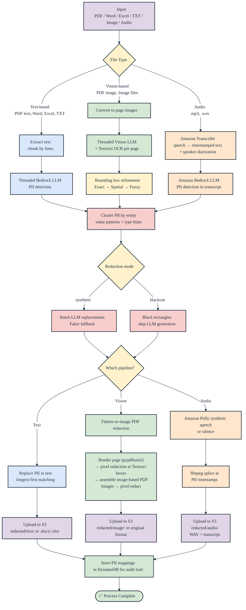
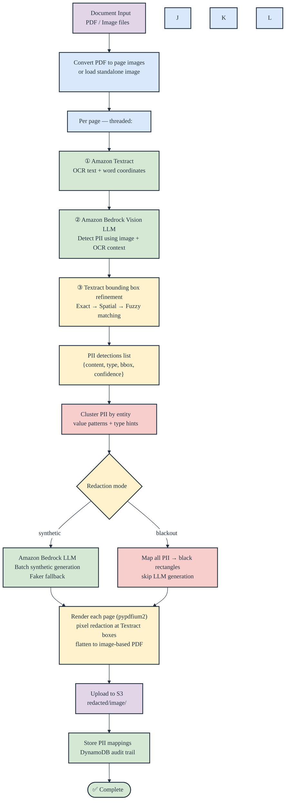
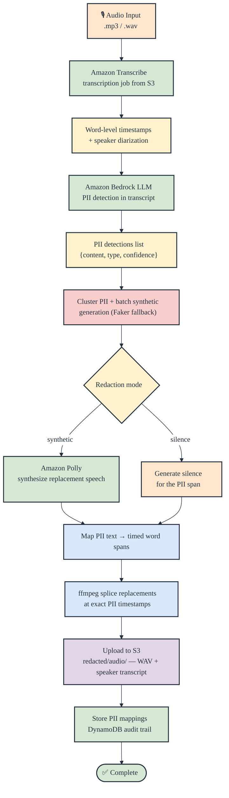
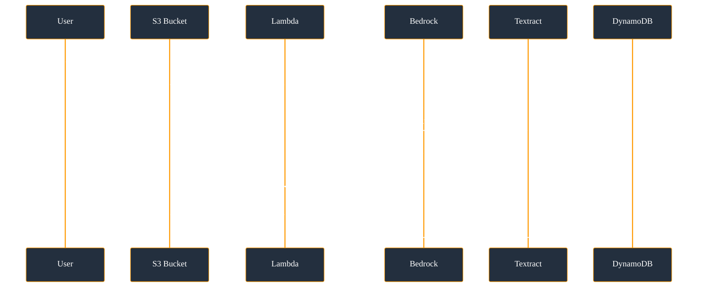
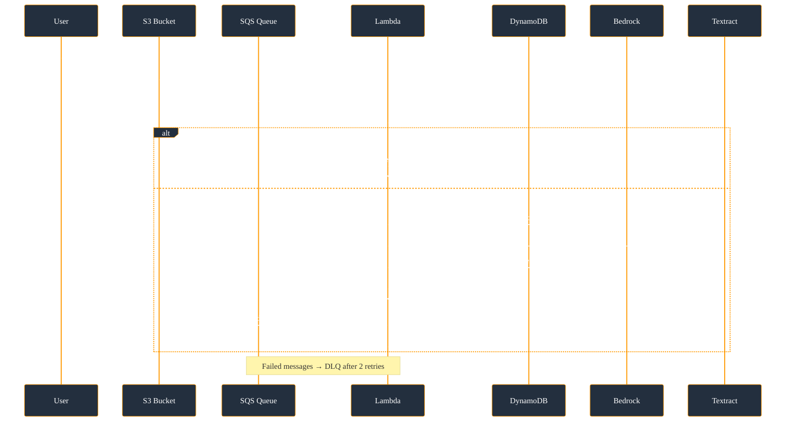
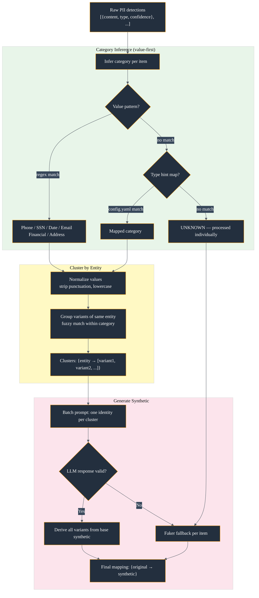

# PII Anonymization System — Workflow Diagrams

## Processing Pipeline

## Text-Based Approach (PDF text / Word / Excel / TXT)

```mermaid
%%{init: {'theme': 'base', 'themeVariables': {'primaryColor': '#FFFFFF', 'primaryTextColor': '#232F3E', 'lineColor': '#232F3E', 'fontFamily': 'Amazon Ember, Helvetica, Arial, sans-serif'}}}%%
flowchart TD
    A["📄 Document Input<br/>PDF / Word / Excel / TXT"] --> B["Extract text from document"]
    B --> C["Chunk text by lines<br/>token-aware splitting"]
    C --> D["Amazon Bedrock LLM<br/>Threaded PII detection<br/>N workers in parallel"]
    D --> E["PII detections list<br/>{content, type, confidence}"]

    E --> F["Cluster PII by entity<br/>value patterns + type hints"]
    F --> G["Amazon Bedrock LLM<br/>Batch synthetic generation<br/>one identity per cluster"]
    G --> H{"LLM success?"}
    H -->|"Yes"| I["PII mapping<br/>original → synthetic"]
    H -->|"No"| J["Faker fallback<br/>per item"]
    J --> I

    I --> K["Replace PII in text<br/>longest-first matching"]
    K --> L["Upload to S3<br/>redacted/text/"]
    L --> M["Store PII mappings<br/>DynamoDB audit trail"]
    M --> N(["✅ Complete"])

    style A fill:#E1D5E7,color:#232F3E,stroke:#232F3E,stroke-width:2px
    style B fill:#DAE8FC,color:#232F3E,stroke:#232F3E,stroke-width:2px
    style C fill:#DAE8FC,color:#232F3E,stroke:#232F3E,stroke-width:2px
    style D fill:#D5E8D4,color:#232F3E,stroke:#232F3E,stroke-width:2px
    style E fill:#FFF2CC,color:#232F3E,stroke:#232F3E,stroke-width:2px
    style F fill:#F8CECC,color:#232F3E,stroke:#232F3E,stroke-width:2px
    style G fill:#D5E8D4,color:#232F3E,stroke:#232F3E,stroke-width:2px
    style H fill:#FFF2CC,color:#232F3E,stroke:#232F3E,stroke-width:2px
    style I fill:#F8CECC,color:#232F3E,stroke:#232F3E,stroke-width:2px
    style J fill:#F8CECC,color:#232F3E,stroke:#232F3E,stroke-width:2px
    style K fill:#DAE8FC,color:#232F3E,stroke:#232F3E,stroke-width:2px
    style L fill:#E1D5E7,color:#232F3E,stroke:#232F3E,stroke-width:2px
    style M fill:#D5E8D4,color:#232F3E,stroke:#232F3E,stroke-width:2px
    style N fill:#D5E8D4,color:#232F3E,stroke:#232F3E,stroke-width:2px
```

## Image-Based Approach (PDF image / standalone images)

## Audio-Based Approach (.mp3 / .wav)

## Trigger Flows

### Direct S3 → Lambda (no SQS)

### S3 → SQS → Lambda (with SQS)

## Clustering & Synthetic Generation Detail

